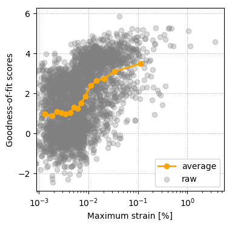
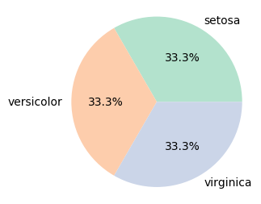
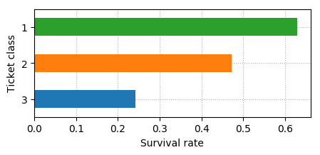
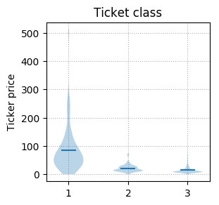

# Python plotting utilities: `plot_utils`

This is a Python module that contains some useful plotting utilities. Current functionalities include:

+ **3D histograms**: visualizing multiple distributions easily and elegantly [[doc](./docs/histogram3d.md)], [[example](./examples/3D_histograms_example.ipynb)]
+ **Discrete histogram**, suitable for visualizing categorical values [[doc](./docs/discrete_histogram.md)], [[example](./examples/Discrete_histogram_example.ipynb)]
+ **Choropleth map** (aka "heat map") of the United States, on both state and county level [[doc](./docs/choropleth_map.md)], [[example](./examples/Choropleth_map_example.ipynb)]
+ **Correlation matrix** (aka "covariance matrix") of a dataset [[doc](./docs/plot_correlation.md)], [[example](./examples/Correlation_matrix_examples.ipynb)]
  + and the one-to-one **scatter plots** for the variables within the dataset [[doc](./docs/scatter_plots_two_cols.md)]
+ **"Bin-and-mean" plot**, a good way to uncover the dependency between two variables [[doc](./docs/bin_and_mean.md)], [[example](./examples/Bin-and-mean_example.ipynb)]
+ A **get_colors()** function that conveniently queries different qualitative color palettes [[doc](./docs/get_colors.md)], [[example](./examples/Get_color_linespec_scheme_examples.ipynb)]
    + and a **get_linespecs()** function that generates distinct color/linestyle/linewidth combinations for plotting many lines [[doc](./docs/get_linespecs.md)], [[example](./examples/Get_color_linespec_scheme_examples.ipynb)]
+ **Pie chart** to visualize proportions, more convenient than matplotlib's `pie()` function [[doc](./docs/piechart.md)], [[example](./examples/Pie_chart_example.ipynb)]
+ **Time series plotting**, for visualizing single or multiple time series data quickly and elegantly [[doc](./docs/plot_timeseries.md)], [[example](./examples/Plot_time_series_example.ipynb)]
+ **Plotting with upper/lower error bounds**, which displays error bounds as shaded areas [[doc](./docs/plot_with_error_bounds.md)], [[example](./examples/Plot_with_error_bounds_example.ipynb)]
+ **Count missing values**: shows how many missing values are there in each column of the data set [[doc](./docs/missing_value_counts.md)], [[example](./examples/Missing_value_count_example.ipynb)]
+ **Categorical feature visualization**: shows different proportion or mean values associated with each category [[doc](./docs/categorical_data.md)], [[example](./examples/Categorical_variables_example.ipynb)]


## Gallery

### 1. Three-dimensional histograms

Plots 3D histograms. Useful for comparing multiple distributions.

```python
>>> import plot_utils as pu
>>> pu.histogram3d(X)  # X is the dataset to be visualized
```

[[doc](./docs/histogram3d.md)], [[example](./examples/3D_histograms_example.ipynb)]


### 2. Choropleth map (state level)

Plots state-level choropleth maps from a Python dictionary or Pandas Series/DataFrame.

```python
>>> import plot_utils as pu
>>> pu.choropleth_map_state(state_level_data)
```

[[doc](./docs/choropleth_map.md)], [[example](./examples/Choropleth_map_example.ipynb)]


### 3. Choropleth map (county level)

Plots county-level choropleth map from a Python dictionary or Pandas Series/DataFrame.

```python
>>> import plot_utils as pu
>>> pu.choropleth_map_county(county_level_data)
```

[[doc](./docs/choropleth_map.md#plot_utilschoropleth_map_county)], [[example](./examples/Choropleth_map_example.ipynb)]


### 4. Correlation matrix (aka, covariance matrix)

Plots correlation matrix of a dataset, `X`. Also automatically generates scatter plots of variables with high correlations.

```python
>>> import plot_utils as pu
>>> pu.plot_correlation(X, scatter_plots=True)
```

[[doc](./docs/plot_correlation.md)], [[example](./examples/Correlation_matrix_examples.ipynb)]


### 5. "Bin-and-mean" plot

Useful for discovering correlation within data.

```python
>>> import plot_utils as pu
>>> pu.bin_and_mean(x, y, logx=True,
         xlabel='Maximum strain [%]',ylabel='Goodness-of-fit scores')
```

[[doc](./docs/bin_and_mean.md)], [[example](./examples/Bin-and-mean_example.ipynb)]



### 6.1. `get_colors()` function

Easy querying of distinguishable color palettes.

```python
>>> import seaborn as sns
>>> import plot_utils as pu
>>> colors = pu.get_colors(color_scheme='tab10',N=10)
>>> sns.palplot(colors)
```

[[doc](./docs/get_colors.md)], [[example](./examples/Get_color_linespec_scheme_examples.ipynb)]


### 6.2. `get_linespecs()` function

Easy querying of distinguishable line specs.

```python
>>> import plot_utils as pu
>>> line_specs = pu.get_linespecs(color_scheme='bw',range_linewidth=[3,8],priority='linewidth')
>>> pu.linespecs_demo(line_specs)
```

[[doc](./docs/get_linespecs.md)], [[example](./examples/Get_color_linespec_scheme_examples.ipynb)]


### 7. Pie chart

Plots a pie chart from a single array.

```Python
>>> import plot_utils as pu
>>> pu.piechart(iris['species'])
```

[[doc](./docs/piechart.md)], [[example](./examples/Pie_chart_example.ipynb)] 



### 8. Time series plotting

Plots single or multiple time series data on the same plot nicely.

```Python
>>> import plot_utils as pu
>>> pu.plot_time_series(x)  # plots single time series
>>> pu.plot_multiple_timeseries(X)  # plots multiple time series
```

[[doc](./docs/plot_timeseries.md)], [[example](./examples/Plot_time_series_example.ipynb)]


### 9. Plot with error bounds

Plots data and error bounds on the same graph.

```python
>>> import plot_utils as pu
>>> pu.plot_with_error_bounds(data,upper_bound,lower_bound)
```

[[doc](./docs/plot_with_error_bounds.md)], [[example](./examples/Plot_with_error_bounds_example.ipynb)]


### 10. Count missing values

Summarizes how many missing values are there in each column of the data set.

```python
>>> import plot_utils as pu
>>> data = pd.read_csv('./datasets/titanic.csv')
>>> pu.missing_value_counts(data)
```

[[doc](./docs/missing_value_counts.md)], [[example](./examples/Missing_value_count_example.ipynb)]


### 11. Visualize categorical features

Shows different proportion or mean values associated with each category [[doc](./docs/categorical_data.md)], [[example](./examples/Categorical_variables_example.ipynb)]


```python
>>> import plot_utils as pu
>>> df = pd.read_csv('./datasets/titanic.csv')
>>> pu.positive_rate(df['Pclass'], df['Survived'], ylabel='Ticket class', xlabel='Survival rate', figsize=(5,2));
>>> pu.category_means(df['Pclass'], df['Fare'],  ylabel='Ticker price', title='Ticket class');
```

[[doc](./docs/categorical_data.md)], [[example](./examples/Categorical_variables_example.ipynb)]






## Installation

No installation required.

Just download this repository, and you can put `plot_utils.py` anywhere within your Python search path.


## Dependencies

+ Python 2.7 or 3.5+
+ matplotlib 1.5.0+, or 2.0.0+ (Version 2.1.0+ is strongly recommended.)
+ numpy: 1.11.0+
+ scipy: 0.19.0+
+ pandas: 0.20.0+
+ matplotlib/basemap: 1.0.7 (only if you want to plot the two choropleth maps)


## Aesthetics

The aesthetics of of the `plot_utils` module are matplotlib-styled by default, but it doesn't mean that you can't use your favorite styles in seaborn or ggplot2.

Unlike some plotting packages that enforces their own styles and restrict users from customizing, users of this module can adjust the figure styles freely: either from within matplotlib (https://matplotlib.org/devdocs/gallery/style_sheets/style_sheets_reference.html), or `import seaborn` and let seaborn take care of everything.


## References

I did not built every function of this module entirely from scratch. I documented the sources that I referenced in the documentation of the corresponding functions.


## Copyright and license

(c) 2017-2018, Jian Shi

License: GPL v3.0
